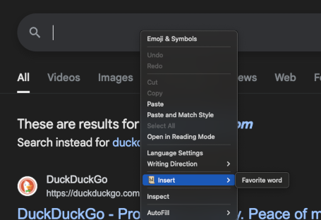
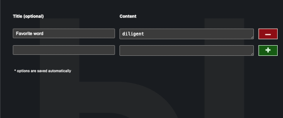

# WitFast

WitFast is a minimalistic Chrome Extension for injecting predefined text values through the context menu and one root item.

Check screenshots, if you are not sure.

## Dev Notes

This is my first experience with Chrome extension development. During this project I experimented with minimalistic UIs which do not require full-packed frameworks.

For this project I used [Bun](https://bun.sh/) as a package manager and bundler. For UI I eventually picked [Preact](https://preactjs.com/), though my first attempt was with [Alpinejs](https://alpinejs.dev/). Unfortunately, Chrome has very serious CSP, and it leads to a lot of constraints which make work with Alpinejs not so straightforward and pleasant for me (check ["CSP (Content-Security Policy) Build"](https://alpinejs.dev/advanced/csp) in the Alipinejs documentation).

I played around with [Pico CSS](https://picocss.com/), beautiful and extremely simple CSS framework. Still, I was thinking about amount of unused code, and decided to shift into more ecological solution with pure CSS taking into account that I don't have a lot of sophisticated UI in this application.

As always, I used [dprint](https://dprint.dev/) for code formatting, which reminds me old good ESLint with detailed rules configuration. Good tool or solution should not be opinionated, it should be scientifically proven, I believe.

I kindly asking do not throw stones into me when if you see bad code structure. I rarely work with small projects, and didn't spend a lot of time on designing project structure; what I implemented is an absolute minimum for myself to maintain it.

## Installation

This is a one-time experiment and I'm not going to register account for Chrome extensions development, you have only one option: install it manually.

1. Download the archive from the latest [release](https://github.com/akondratsky/witfast/releases)
2. Unpack the archive
3. Open [chrome://extensions/](chrome://extensions/)
4. Switch `Developer mode` on.
5. Press `Load unpacked` button and select the folder with extension files
6. Viola!

## Screenshots

### Menu

### Options page

Options page opens on extension click.

